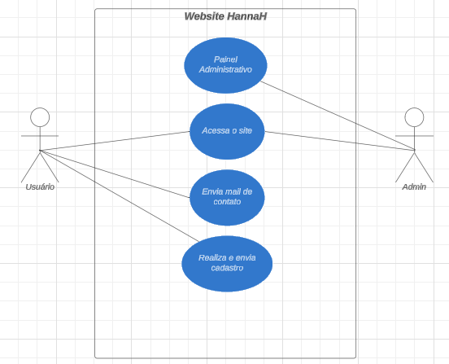

# Website Agência HannaH - PI

## Apresentação geral do Projeto

Este projeto destina-se a ser, alem de um portifólio institucional e de divulgação da empresa, uma plataforma para cadastro de promotores de eventos/freelancers.

Não será necessário criação de conta por parte dos Usuários mas, terá um painel administrativo para gerenciamento deste banco de dados a partir dos cadastros realizados pelos promotores.

## Objetivos

Divulgar a empresa através de demonstração dos serviços ja realizados e os tipos de serviços prestados;

Possibilitar realização de cadastro de promotores de eventos com dados cadastrais e fotos;

Gerenciamento de dados gerados atraves do recebimento dos cadastratos realizados/enviados

## Objetivo Geral

Desenvolver uma plataforma para divulgação da empresa e controle de cadastros.

## Objetivo específicos

- Divulgar a empresa;
- Mostrar tipo de trabalhos realizados;
- Gerenciamento e manipulação de cadastros realizados no Banco de dados.

## Arquitetura do sistema(modelagem)

### Requisitos Funcionais

- RF01: O sistema deve permitir ao usuário/admin se logar;
- RF03: O sistema deve permitir ao usuário/admin gerir banco de dados;
- RF05: O sistema deve permitir ao usuário que ele edite também essas necessidades apontadas que ele possa ter suprido tal necessidade pela  plataforma ou por fora dela;
- RF05: O sistema deve permitir que o usuário que visite o site realize e envie cadastro com dados cadastrais e fotos;

### Requisitos não funcionais

- **RNF01**: O desenvolvimento do sistema deverá utilizar como desenvolvimento Front-End as tecnologias HTML, CSS e JavaScript. E no Back-End a linguagem PHP;
- **RNF02**: O sistema será um website;
- **RNF03**: O banco de dados deverá ser o modo relacional e MySQL;
- **RNF04**: O sistema deverá sere desenvolvido até Ago/24;

### Modelagem funcional

Lista de atores

| Ator | Descrição |
| --- | --- |
| Usuário/Admin | o Admin é o proprietário do sistema. Somente este ator tem acesso ao painel administrador para visualizar e editar cadastros recebidos. |
| Usuário | O usuário é qualquer internauta que visite o site afim de conhecer a empresa ou que tenha interesse em contratação de algum serviço. O usuário também pode ser um promotor(a) de eventos afim de se cadastrar para participar das seleções de vagas que a empresa venha a abrir. |

### Diagrama de caso de uso



### Diagrama Entidade Relacionamento ER

Modelo conceitual


### **Diagrama lógico**


### Scripts SQL para criação de Banco de dados e Tabelas

Criação do banco de dados:

```sql
CREATE DATABASE hannahrh;
```

Criação tabela promotor:

```sql
CREATE TABLE promotor (
id INT AUTO_INCREMENT PRIMARY KEY,
nome VARCHAR(255) NOT NULL,
telefone VARCHAR(20),
email VARCHAR(255)
);
```

Criação da tabela endereço:

```sql
CREATE TABLE endereco(
id INT AUTO_INCREMENT PRIMARY KEY,
promotor_id INT,
rua VARCHAR(255) NOT NULL,
numero VARCHAR(10) NOT NULL,
bairro VARCHAR(255),
cidade VARCHAR(255),
estado VARCHAR(2),
FOREIGN KEY (promotor_id) REFERENCES promotor(id)
);
```

Criação da tabela descrição pessoal:

```sql
CREATE TABLE descricao_pessoal(
id INT AUTO_INCREMENT PRIMARY KEY,
promotor_id INT,
altura DECIMAL(5, 2),
peso DECIMAL(5, 2),
sapato INT,
manequim INT,
FOREIGN KEY (promotor_id) REFERENCES promotor(id)
);
```

Criação da tabela foto:

```sql
CREATE TABLE foto(
id INT AUTO_INCREMENT PRIMARY KEY,
promotor_id INT,
foto1 BLOB,
foto2 BLOB,
foto3 BLOB,
FOREIGN KEY (promotor_id) REFERENCES promotor(id)
);
```

### Detalhamento dos casos de uso

Aqui nesta seção é apresentado o detalhamento dos casos de uso:

- [CSU01 - Usuário realiza cadastro](./docs.md);
- [CSU02 - Painel administrativo](./docs.md);
- [CSU03 - Enviar contato](./docs.md);

### CSU01 - Realiza cadastro

| Caso de uso 1 | Usuário realiza cadastro |
| --- | --- |
| Objetivo | Usuário ao acessar o site e ao clicar no link Cadastre-se é direcionado para a página de cadastro para preenchimento de formulário. |
| Ator | Usuário |
| Pré-condições | Nenhuma |
| Cenário principal | O usuário seleciona a opção desejada.

- Na sequência de cadastro o usuário insere além de seus dados pessoais de cadastro, seleciona fotos para serem enviadas juntamente com seus dados textuais. |

### CSU02 -Painel administrativo

| Caso de uso 2 | Painel administrativo |
| --- | --- |
| Objetivo | Usuário/Admin acessa ao painel para gerenciamento dos cadastros recebidos da pagina cadastre-se. |
| Ator | Usuário/Admin |
| Pré-condições | Somente o Administrador do sistema tem acesso ao painel. |
| Cenário principal | Usuário/Admin acessa ao site, loga no painel e faz suas manipilações. |

### CSU03 - Enviar contato

| Caso de uso 3 | Enviar contato |
| --- | --- |
| Objetivo | Enviar mail de contato. |
| Ator | Usuário |
| Pré-condições | Nenhuma |
| Cenário principal | Usuário ao visitar o site pode acessar a sessão contato e escolher de que forma quer enviar um contato(mail, whats ou instagram) para se comunicar com a empresa. |

### Wireframe, layout e mockup

Utilizei a ferramenta ninja mock para desenvolver wireframe deste projeto.

[link ara vizualizar na plataforma](https://ninjamock.com/s/376CGLx)

print ilustrativo:


## Parte Visual

### Extraindo padrão cromático

A partir da identidade visual da empresa extraímos um possível padrão cromático para trabalhar cores institucionais no projeto.


### Acessibilidade

Teste de contraste para não prejudicar a leitura do usuário considerando design e padrão cromático da empresa.


### Validação e otimização

Foi utilizado ferramentas de validação dos arquivos html e css do projeto afim de ter como resultado um código limpo e eficiente. O site utilizado para validação dos arquivos foi o da W3C.

**HTML Validator** → https://validator.w3.org/detailed.html

**CSS Validator** → https://jigsaw.w3.org/css-validator/

Segue abaixo, capturas das telas das validações dos arquivos HTML’s e dos CSS’s do projeto.

index.html:


formulario.html:


abertura.css:


apresentacao.css:


clientes.css:


footer.css:


header.css:


servicos.css:


styles.css:


### Teste

Utilizei a plataforma [**umbler](https://www.umbler.com/br?utm_source=google&utm_medium=cpc&utm_campaign=20501142415&utm_term=umbler&utm_content=158515057808&gad_source=1&gclid=CjwKCAjwnqK1BhBvEiwAi7o0X2-PR5Q00vCdIEn6f3FBCKCaphYAhMVbWooLjPOC1_ft-j64ahgN0RoCGnwQAvD_BwE)** para subir meu projeto e poder realizar testes de usabilidade. 

**Testes realizados**:

**Teste 1** → Basicamente meus testes foram verificar se o site roda sem nenhum tipo de problema;

**Teste 2** →  se os links que redirecionam para profundidade da página funcionavam;

**Teste 3** → se o link “Cadastre-se” redireciona para a página do “formulário.html”;

**Teste 4** → se o banco de dados foi configurado corretamente e se na plataforma e se os dados enviados no formulário persistem no banco de dados.

**Teste 5** → Na persistência no Banco de Dados ainda estou tendo problemas com as fotos pois o código ainda não está “redondo” e é preciso melhorá-lo pra que seja persistido a referência do caminho no BD e subir as fotos para o caminho determinado. Solução provisória foi comentar as linhas de código referidas para que o resto que está “rodando liso” continue

**OBS.: Os testes pintados em verde significam que foram aprovados. Os em vermelho ainda precisam serem melhorados**

Link da plataforma servidor web umbler com o projeto rodando: **Site da Ag HannaH**